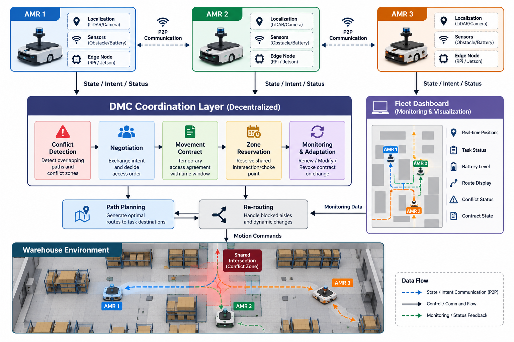

# DMC System Architecture
## Architecture Diagram



## 1. System Overview

The proposed DMC system uses decentralized edge-based coordination between Autonomous Mobile Robots (AMRs).

Each AMR maintains its own local state and communicates relevant movement information to nearby robots.

The coordination process is performed locally rather than depending on continuous centralized decision-making.

## 2. High-Level Architecture

```text
+-------------------+
|      AMR 1        |
| Sensors + Edge    |
| DMC Controller    |
+---------+---------+
          |
          | P2P State / Intent
          |
+---------v---------+
|  DMC Coordination |
|      Layer        |
+---------+---------+
          |
          | P2P State / Intent
          |
+---------+---------+
|      AMR 2        |
| Sensors + Edge    |
| DMC Controller    |
+-------------------+

          ↕
     Nearby AMR 3
          ↕
+-------------------+
| Multi-Agent Path  |
| Planning /        |
| Re-routing        |
+-------------------+

          ↕
+-------------------+
| Fleet Dashboard   |
| Position / Battery|
| Task Status       |
+-------------------+
## DMC Internal Architecture

Robot Sensors / Localization
          ↓
      Robot State
          ↓
    Intent Generator
          ↓
   P2P Communication
          ↓
   Conflict Detection
          ↓
   DMC Negotiation
          ↓
 Conflict-Zone Reservation
          ↓
    Path Execution
          ↓
   Monitor & Adapt
      ↙         ↘
 Re-route     Revoke Contract

## Module Responsibilities

| Module | Responsibility |
|---|---|
| Localization | Robot position and movement state |
| P2P Communication | Exchange state and movement intent |
| Conflict Detection | Identify spatial/temporal conflicts |
| DMC Engine | Negotiate movement contracts |
| Reservation | Manage temporary shared-zone access |
| Path Planning | Generate and update robot routes |
| Re-routing | Recover from blocked/conflicting paths |
| Dashboard | Monitor position, battery and task status |
